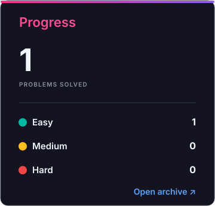
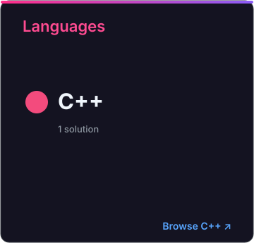
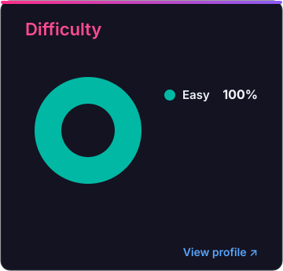

# LeetCode Solutions

A collection of accepted LeetCode solutions automatically synced by LeetBridge.

<!-- SOLUTIONS_START -->

<!-- LEETBRIDGE_ARCHIVE_CELLS_V3 -->

<picture>

</picture>

<table align="center" width="100%">
<tbody>
<tr><td width="53%"></td><td width="17%"><picture></picture></td><td width="30%"></td></tr>
</tbody>
</table>

<!-- SOLUTIONS_END -->

---

## Solved Problems Catalog

Curated list of all algorithmic and data structure problems solved and tracked across LeetCode and NeetCode, categorized by difficulty level.

### Difficulty Overview
| Level | Count |
| :--- | :---: |
| 🟢 **Easy** | 35 |
| 🟡 **Medium** | 11 |
| 🔴 **Hard** | 0 |
| **Total** | **46** |

---

### 🟢 Easy (36 Problems)

| # | Problem | Category / Pattern | Solution |
| :-: | :--- | :--- | :-: |
| 1 | [Baseball Game](<Data Structures & Algorithms/baseball-game>) | Stack / Simulation | [C++](<Data Structures & Algorithms/baseball-game/submission-0.cpp>) |
| 2 | [Concatenation of Array](<Data Structures & Algorithms/concatenation-of-array>) | Array | [C++](<Data Structures & Algorithms/concatenation-of-array/submission-0.cpp>) |
| 3 | [Confusing Number](<Data Structures & Algorithms/confusing-number>) | Math / Hash Table | [C++](<Data Structures & Algorithms/confusing-number/submission-0.cpp>) |
| 4 | [Counting Elements](<Data Structures & Algorithms/counting-elements>) | Hash Set / Counting | [C++](<Data Structures & Algorithms/counting-elements/submission-1.cpp>) |
| 5 | [Duplicate Integer](<Data Structures & Algorithms/duplicate-integer>) | Hash Set (Contains Duplicate) | [C++](<Data Structures & Algorithms/duplicate-integer/submission-0.cpp>) |
| 6 | [Find Anagram Mappings](<Data Structures & Algorithms/find-anagram-mappings>) | Hash Map | [C++](<Data Structures & Algorithms/find-anagram-mappings/submission-0.cpp>) |
| 7 | [Implement Stack using Queues](<Data Structures & Algorithms/implement-stack-using-queues>) | Stack / Design | [C++](<Data Structures & Algorithms/implement-stack-using-queues/submission-0.cpp>) |
| 8 | [Is Anagram](<Data Structures & Algorithms/is-anagram>) | Hash Table / String | [C++](<Data Structures & Algorithms/is-anagram/submission-1.cpp>) |
| 9 | [Is Palindrome](<Data Structures & Algorithms/is-palindrome>) | Two Pointers / String | [C++](<Data Structures & Algorithms/is-palindrome/submission-1.cpp>) |
| 10 | [Is Subsequence](<Data Structures & Algorithms/is-subsequence>) | Two Pointers | [C++](<Data Structures & Algorithms/is-subsequence/submission-0.cpp>) |
| 11 | [Largest Unique Number](<Data Structures & Algorithms/largest-unique-number>) | Hash Map / Counting | [C++](<Data Structures & Algorithms/largest-unique-number/submission-0.cpp>) |
| 12 | [Length of Last Word](<Data Structures & Algorithms/length-of-last-word>) | String Manipulation | [C++](<Data Structures & Algorithms/length-of-last-word/submission-0.cpp>) |
| 13 | [Longest Common Prefix](<Data Structures & Algorithms/longest-common-prefix>) | Array / String | [C++](<Data Structures & Algorithms/longest-common-prefix/submission-0.cpp>) |
| 14 | [Max Consecutive Ones](<Data Structures & Algorithms/max-consecutive-ones>) | Array / Sliding Window | [C++](<Data Structures & Algorithms/max-consecutive-ones/submission-0.cpp>) |
| 15 | [Merge Sorted Array](<Data Structures & Algorithms/merge-sorted-array>) | Two Pointers | [C++](<Data Structures & Algorithms/merge-sorted-array/submission-0.cpp>) |
| 16 | [Merge Strings Alternately](<Data Structures & Algorithms/merge-strings-alternately>) | Two Pointers / String | [C++](<Data Structures & Algorithms/merge-strings-alternately/submission-0.cpp>) |
| 17 | [Merge Two Sorted Linked Lists](<Data Structures & Algorithms/merge-two-sorted-linked-lists>) | Linked List / Two Pointers | [C++](<Data Structures & Algorithms/merge-two-sorted-linked-lists/submission-0.cpp>) |
| 18 | [Moving Average from Data Stream](<Data Structures & Algorithms/moving-average-from-data-stream>) | Queue / Design | [C++](<Data Structures & Algorithms/moving-average-from-data-stream/submission-0.cpp>) |
| 19 | [Number of Senior Citizens](<Data Structures & Algorithms/number-of-senior-citizens>) | Array / String | [C++](<Data Structures & Algorithms/number-of-senior-citizens/submission-0.cpp>) |
| 20 | [Number of Students Unable to Eat Lunch](<Data Structures & Algorithms/number-of-students-unable-to-eat-lunch>) | Array / Stack | [C++](<Data Structures & Algorithms/number-of-students-unable-to-eat-lunch/submission-1.cpp>) |
| 21 | [Palindrome Permutation](<Data Structures & Algorithms/palindrome-permutation>) | Hash Set / Bitmask | [C++](<Data Structures & Algorithms/palindrome-permutation/submission-0.cpp>) |
| 22 | [Perform String Shifts](<Data Structures & Algorithms/perform-string-shifts>) | String / Math | [C++](<Data Structures & Algorithms/perform-string-shifts/submission-0.cpp>) |
| 23 | [Remove Element](<Data Structures & Algorithms/remove-element>) | Two Pointers / Array | [C++](<Data Structures & Algorithms/remove-element/submission-0.cpp>) |
| 24 | [Replace Elements with Greatest Element on Right Side](<Data Structures & Algorithms/replace-elements-with-greatest-element-on-right-side>) | Array / Traversal from Right | [C++](<Data Structures & Algorithms/replace-elements-with-greatest-element-on-right-side/submission-0.cpp>) |
| 25 | [Reverse a Linked List](<Data Structures & Algorithms/reverse-a-linked-list>) | Linked List | [C++](<Data Structures & Algorithms/reverse-a-linked-list/submission-1.cpp>) |
| 26 | [Reverse String](<Data Structures & Algorithms/reverse-string>) | Two Pointers / String | [C++](<Data Structures & Algorithms/reverse-string/submission-0.cpp>) |
| 27 | [Score of a String](<Data Structures & Algorithms/score-of-a-string>) | String / Math | [C++](<Data Structures & Algorithms/score-of-a-string/submission-0.cpp>) |
| 28 | [Sentence Similarity](<Data Structures & Algorithms/sentence-similarity>) | Hash Set / Map | [C++](<Data Structures & Algorithms/sentence-similarity/submission-0.cpp>) |
| 29 | [Single-Row Keyboard](<Data Structures & Algorithms/single-row-keyboard>) | Hash Map / String | [C++](<Data Structures & Algorithms/single-row-keyboard/submission-0.cpp>) |
| 30 | [String Matching in an Array](<Data Structures & Algorithms/string-matching-in-an-array>) | Array / String | [C++](<Data Structures & Algorithms/string-matching-in-an-array/submission-0.cpp>) |
| 31 | [Two Sum](<0001-two-sum>) | Array / Hash Table | [C++](<0001-two-sum/solution.cpp>) |
| 32 | [Valid Palindrome II](<Data Structures & Algorithms/valid-palindrome-ii>) | Two Pointers / Greedy | [C++](<Data Structures & Algorithms/valid-palindrome-ii/submission-1.cpp>) |
| 33 | [Valid Word Abbreviation](<Data Structures & Algorithms/valid-word-abbreviation>) | Two Pointers / String | [C++](<Data Structures & Algorithms/valid-word-abbreviation/submission-0.cpp>) |
| 34 | [Valid Word Square](<Data Structures & Algorithms/valid-word-square>) | Matrix / String | [C++](<Data Structures & Algorithms/valid-word-square/submission-1.cpp>) |
| 35 | [Validate Parentheses](<Data Structures & Algorithms/validate-parentheses>) | Stack | [C++](<Data Structures & Algorithms/validate-parentheses/submission-0.cpp>) |

---

### 🟡 Medium (10 Problems)

| # | Problem | Category / Pattern | Solution |
| :-: | :--- | :--- | :-: |
| 1 | [Append Characters to String to Make Subsequence](<Data Structures & Algorithms/append-characters-to-string-to-make-subsequence>) | Two Pointers / Greedy | [C++](<Data Structures & Algorithms/append-characters-to-string-to-make-subsequence/submission-0.cpp>) |
| 2 | [Design Browser History](<Data Structures & Algorithms/design-browser-history>) | Array / Linked List | [C++](<Data Structures & Algorithms/design-browser-history/submission-0.cpp>) |
| 3 | [Design Linked List](<0707-design-linked-list>) | Linked List / Design | [C++](<0707-design-linked-list/solution.cpp>) |
| 4 | [Find Smallest Common Element in All Rows](<Data Structures & Algorithms/find-smallest-common-element-in-all-rows>) | Matrix / Counting / Binary Search | [C++](<Data Structures & Algorithms/find-smallest-common-element-in-all-rows/submission-2.cpp>) |
| 5 | [Lonely Pixel I](<Data Structures & Algorithms/lonely-pixel-i>) | Matrix / Hash Table / Counting | [C++](<Data Structures & Algorithms/lonely-pixel-i/submission-0.cpp>) |
| 6 | [Maximum Distance in Arrays](<Data Structures & Algorithms/maximum-distance-in-arrays>) | Greedy / Array | [C++](<Data Structures & Algorithms/maximum-distance-in-arrays/submission-0.cpp>) |
| 7 | [Minimum Stack](<Data Structures & Algorithms/minimum-stack>) | Stack / Design | [C++](<Data Structures & Algorithms/minimum-stack/submission-0.cpp>) |
| 8 | [One Edit Distance](<Data Structures & Algorithms/one-edit-distance>) | String / Two Pointers | [C++](<Data Structures & Algorithms/one-edit-distance/submission-0.cpp>) |
| 9 | [Reverse Words in a String II](<Data Structures & Algorithms/reverse-words-in-a-string-ii>) | Two Pointers / In-place Array | [C++](<Data Structures & Algorithms/reverse-words-in-a-string-ii/submission-0.cpp>) |
| 10 | [Valid Sudoku](<Data Structures & Algorithms/valid-sudoku>) | Matrix / Hash Set | [C++](<Data Structures & Algorithms/valid-sudoku/submission-0.cpp>) |
| 11 | [Anagram Groups](<Data Structures & Algorithms/anagram-groups>) | Algorithms | [C++](<Data Structures & Algorithms/anagram-groups/submission-0.cpp>) |

